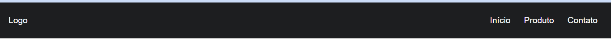

# *Website-basico*
## Começando um projeto de sites de exemplo: 
 

### Vamos clonar? 💻
 

~~~~
 $ git clone https://github.com/Igorios/website-basico.git
~~~~
#

### Trabalhei principalmente com um menu básico de um site. Como resultado:
 

#

### 👨‍💻 Site em desenvolvimento....